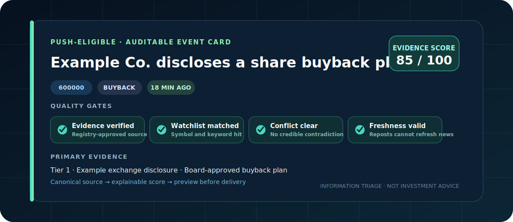
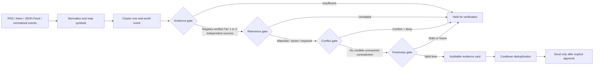

<p align="center">
  
</p>

<p align="center">
  English · <a href="README_ZH.md">Chinese</a>
</p>

<p align="center">
  
  
  <a href="https://github.com/FullFighting/a-share-evidence-radar/actions/workflows/validate.yml"></a>
  
  
</p>

# A-share Evidence Radar

An evidence-first Codex Skill that turns company disclosures, regulator updates, financial news, and observed market reactions into low-noise, auditable alert cards.

> Registry-verified primary evidence or two independent sources → watchlist relevance → no credible contradiction → fresh timestamp → alert eligibility.

It is not another headline forwarder. The radar clusters likely duplicate coverage, collapses exact-content copies and explicitly labeled shared origins, separates price reaction from causal claims, and defaults to a redacted delivery preview. Rewritten syndication is not claimed to be detected automatically without provenance labels.

## What an alert looks like

<p align="center">
  
</p>

Each card answers five questions: **what happened, who is affected, where the evidence came from, why the alert matters, and what could invalidate it**. A headline match alone never triggers an external send.

## What makes it different

| Capability | Keyword bot | Price alert | Evidence Radar |
|---|:---:|:---:|:---:|
| Cross-source event clustering | — | — | ✓ |
| Syndication-aware source counting | — | — | ✓ |
| Confirmation/denial conflict gate | — | — | ✓ |
| Watchlist, sector, and keyword relevance gate | Partial | ✓ | ✓ |
| Auditable score breakdown | — | — | ✓ |
| Safe multi-channel delivery preview | Partial | Partial | ✓ |
| Public behavioral benchmark | — | — | ✓ |

## 30-second offline demo

Python 3.10+ is the only runtime requirement. These commands make no network request.

On Windows, if `python` opens the Microsoft Store, install Python 3.10+ and replace `python` below with `py -3.10`. On Linux/macOS, `python3` is commonly the right launcher.

```bash
python skills/monitor-a-share-events/scripts/doctor.py

python skills/monitor-a-share-events/scripts/validate_config.py \
  --config skills/monitor-a-share-events/assets/examples/radar-config.json

python skills/monitor-a-share-events/scripts/run_radar.py \
  --config skills/monitor-a-share-events/assets/examples/radar-config.json

python skills/monitor-a-share-events/scripts/evaluate_radar.py
```

Expected results: `READY` from the doctor and `40/40 (100.0%)` from the current public regression suite. This score means only that the published fictional cases match their expected behavior; it is not market accuracy.

The config validator performs no network request. Run it before using a real feed; it checks local paths, parameter ranges, source-registry shape, and credential-like values accidentally placed in JSON.

## Install as a Codex Skill

Copy or symlink `skills/monitor-a-share-events` into the repository or personal Skills directory used by your Codex setup. The [OpenAI Skills overview](https://help.openai.com/en/articles/20001066) describes Skills as portable workflows supported in Codex; installation surfaces can vary by account and workspace. This repository also includes `.codex-plugin/plugin.json` for plugin distribution.

Then invoke it explicitly:

```text
Use $monitor-a-share-events to monitor my A-share watchlist. Merge disclosures, news, and observed market reactions into low-noise evidence cards. Preview only; do not send.
```

## Pipeline



Every card exposes `score_breakdown`, `evidence_gate`, `relevance_gate`, `conflict_gate`, `freshness_gate`, independent-source count, original links, observed market reaction, and invalidation conditions.

## Source collection

`collect_feeds.py` supports local files and explicit HTTPS RSS, Atom, and JSON Feed URLs. `collect_sse_disclosures.py` and `collect_szse_disclosures.py` normalize official exchange disclosure metadata. Each primary adapter has contract fixtures and failure fixtures; live endpoint availability is not treated as a correctness guarantee.

Remote collection uses an HTTPS-only client with public-address checks, a response-size cap, bounded redirects and retries, per-host pacing, and optional ETag/Last-Modified caching. It does not log in, bypass CAPTCHAs, scrape paywalls, or interpret successful parsing as verified truth.

```bash
python skills/monitor-a-share-events/scripts/collect_sse_disclosures.py --symbol 600000 --output sse-events.jsonl
python skills/monitor-a-share-events/scripts/collect_szse_disclosures.py --symbol 000001 --output szse-events.jsonl
```

`--source-tier` is only an operator assertion. Fusion ignores an event-file `source_tier_verified` flag and independently checks the registry plus an allowed canonical `https` URL or stable ID. The collector collapses exact cross-site copies through content fingerprints; rewritten syndication still needs a shared `evidence_origin`, and recycled news should preserve the underlying `event_at`. See the [event contract](skills/monitor-a-share-events/references/event-schema.md) and [source policy](skills/monitor-a-share-events/references/source-policy.md).

## Safe delivery

Feishu, DingTalk, WeCom, Telegram, Bark, and generic Webhooks are supported. Without `--send`, the tool prints a redacted preview and performs no network write. Credentials must be supplied through environment variables and must never be committed.

## Quality and contribution

The public suite combines [core cases](skills/monitor-a-share-events/references/benchmark-cases.json) with [edge cases](skills/monitor-a-share-events/references/benchmark-edge-cases.json). Its 40 fictional cases cover authority, corroboration, duplicate-origin counting, conflicts, relevance, timestamp boundaries, forged Tier 1 claims, republication, event types, and exact-content fingerprints.

```bash
python -m unittest discover -s tests -v
python skills/monitor-a-share-events/scripts/evaluate_radar.py
```

The benchmark score describes only the published cases, not real-market accuracy. The most valuable contributions are anonymized failures, source adapters, clustering counterexamples, provenance labels, and secure notification channels. Read [CONTRIBUTING.md](CONTRIBUTING.md) and [SECURITY.md](SECURITY.md) before contributing.

## Early beta

We are looking for five real testers who maintain Codex workflows, research A-share public information, or build feed/event integrations. The test takes about 15 minutes, is offline by default, and must not include private holdings or credentials. See the [beta guide](docs/beta-testing.md) and use the structured **Beta feedback** Issue form.

Verified adoption is recorded in [ADOPTERS.md](ADOPTERS.md); project decisions and release responsibility are documented in [GOVERNANCE.md](GOVERNANCE.md). Empty evidence stays empty rather than being replaced with estimates.

## Codex maintenance evidence

The manually dispatched `codex-maintenance-preview` workflow can turn one reviewed public Issue into a regression proposal. It is preview-only unless `call_api` is explicitly enabled, stores no API response by default, uploads a reviewable artifact, and records returned token usage. Human acceptance and time-saved measurements belong in [docs/maintenance-metrics.md](docs/maintenance-metrics.md); no usage claim is made before measured runs exist.

## Roadmap

- [x] Deterministic clustering, scoring, and four quality gates
- [x] RSS / Atom / JSON Feed adapter
- [x] Six delivery channels, cooldown state, doctor, and benchmark
- [x] Contract-tested SSE and SZSE primary-disclosure adapters
- [ ] Market-reaction adapters that avoid causal overclaiming
- [ ] Community-maintained false-positive and false-negative corpus
- [x] Codex plugin manifest and standard distribution layout
- [x] Versioned GitHub releases
- [ ] Public marketplace installation

## Boundaries

This project only processes information the user is authorized to access. It does not bypass access controls, represent delayed public data as exchange-grade real time, connect to brokerage accounts, execute orders, or provide deterministic trading calls.

MIT License. See [LICENSE](LICENSE).
