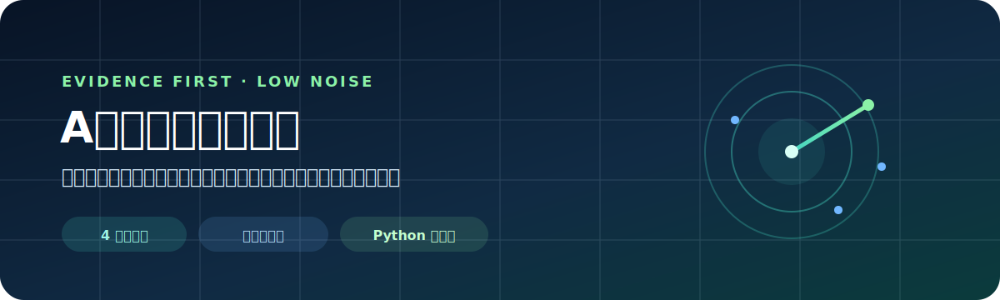
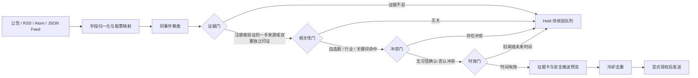

<p align="center">
  
</p>

<p align="center">
  <a href="README_EN.md">English</a> · 中文
</p>

<p align="center">
  
  
  
  
</p>

# A股证据链事件雷达

把公告、监管披露、财经新闻与盘中异动融合成一张有来源、有反证、有推送理由的事件卡。它解决的不是“消息不够多”，而是**重复转载、传闻混入、因果乱配和自选股噪声太多**。

> 注册表验证的一手来源或双重独立印证 → 自选股相关 → 无可信冲突 → 时间有效 → 才有资格推送。

## 为什么值得用

常见股票机器人在标题命中关键词后立即转发。本项目多做了一层“证据工程”：

| 能力 | 关键词转发器 | 价格提醒器 | A股证据链事件雷达 |
|---|:---:|:---:|:---:|
| 公告 / 新闻采集 | ✓ | — | ✓ |
| 同事件跨来源聚类 | — | — | ✓ |
| 转载不冒充独立信源 | — | — | ✓ |
| 确认 / 否认冲突拦截 | — | — | ✓ |
| 自选股、行业、关键词相关性门槛 | 部分 | ✓ | ✓ |
| 可审计评分拆解 | — | — | ✓ |
| 飞书 / 钉钉 / 企微 / Telegram / Bark / Webhook | 部分 | 部分 | ✓ |
| 默认不发送、密钥脱敏 | — | — | ✓ |
| 公开回归评测 | — | — | ✓ |

## 30 秒离线体验

只需要 Python 3.10+，没有第三方运行时依赖，也不会发起网络请求。

Windows 若 `python` 打开 Microsoft Store，请安装 Python 3.10+ 并将下方命令中的 `python` 替换为 `py -3.10`；Linux/macOS 通常可替换为 `python3`。

```powershell
# 1. 环境与离线冒烟检查
python skills/monitor-a-share-events/scripts/doctor.py

# 2. 一条命令完成采集、映射、聚类与证据卡生成
python skills/monitor-a-share-events/scripts/run_radar.py `
  --config skills/monitor-a-share-events/assets/examples/radar-config.json

# 3. 运行公开行为基准
python skills/monitor-a-share-events/scripts/evaluate_radar.py
```

期望结果：自检显示 `READY`，公开基准显示 `10/10 (100.0%)`。示例全部为虚构内容，便于安全复现。

已有标准 JSON/JSONL 事件时，可直接运行：

```powershell
python skills/monitor-a-share-events/scripts/fuse_events.py `
  --events skills/monitor-a-share-events/assets/examples/events.jsonl `
  --watchlist skills/monitor-a-share-events/assets/examples/watchlist.json `
  --source-registry skills/monitor-a-share-events/assets/examples/source-registry.json `
  --now 2026-07-21T10:00:00+08:00 `
  --format markdown `
  --include-held
```

输出示例见 [alert-preview.md](skills/monitor-a-share-events/assets/examples/alert-preview.md)。

## 安装为 Codex Skill

根据 [Codex 官方 Skill 文档](https://learn.chatgpt.com/docs/build-skills)，仓库级 Skill 放在 `$REPO_ROOT/.agents/skills`，个人级 Skill 放在 `$HOME/.agents/skills`。你可以复制或软链接本仓库中的 `skills/monitor-a-share-events` 目录；Codex 会自动检测变更，未出现时重启 Codex。本仓库也已包含 `.codex-plugin/plugin.json`，可作为插件分发。

```powershell
# 仓库级安装示例
New-Item -ItemType Directory -Force .agents\skills | Out-Null
Copy-Item -Recurse skills\monitor-a-share-events .agents\skills\monitor-a-share-events
```

安装后可直接说：

```text
使用 $monitor-a-share-events 监控我的 A 股自选股，把公告、新闻和行情反应合并成低噪声证据卡，先预览，不要发送。
```

也可以让 `$skill-installer` 从 GitHub 仓库安装。项目公开发布后，我们计划再打包为可安装插件，降低分发门槛。

## 工作流



每张卡都会公开：`score_breakdown`、`evidence_gate`、`relevance_gate`、`conflict_gate`、`freshness_gate`、独立来源数、原始链接、观察到的行情反应和失效条件。

## 接入自己的来源

`collect_feeds.py` 支持本地文件和用户明确提供的 `http(s)` RSS、Atom、JSON Feed。它不登录、不绕过验证码、不抓取付费墙，也不会把“解析成功”当成“事实已证实”。

```powershell
python skills/monitor-a-share-events/scripts/collect_feeds.py `
  --feed https://your-authorized-source.example/feed.xml `
  --watchlist my-watchlist.json `
  --source-tier 3 `
  --output events.jsonl
```

`--source-tier` 只是操作者声明；融合器不会信任事件文件中的 `source_tier_verified`，而会重新读取来源注册表并校验规范 `https` 链接或注册表认可的稳定 ID。采集器会用精确内容指纹合并完全相同的跨站转载，改写稿仍需设置相同 `evidence_origin`；旧闻重发应填写底层 `event_at`，避免刷新时效。事件契约见 [event-schema.md](skills/monitor-a-share-events/references/event-schema.md)，来源规则见 [source-policy.md](skills/monitor-a-share-events/references/source-policy.md)。

## 安全推送

默认模式只输出脱敏预览，不执行外部写入：

```powershell
$env:FEISHU_WEBHOOK_URL = "https://example.invalid/webhook/secret"
python skills/monitor-a-share-events/scripts/push_alert.py `
  --channel feishu `
  --input skills/monitor-a-share-events/assets/examples/alert-preview.md
```

只有用户明确授权外部发送后才添加 `--send`。Webhook、Bot Token、Chat ID 等密钥必须放在环境变量中，禁止提交到仓库。

## 公开评测与质量承诺

[benchmark-cases.json](skills/monitor-a-share-events/references/benchmark-cases.json) 当前覆盖：权威公告、独立信源印证、单一传闻、转载冒充多源、确认/否认冲突、无关权威消息、过期旧闻、未来时间戳、伪造 Tier 1，以及旧闻重新发布。修改聚类、评分或四道门规则时，必须新增或更新对应案例。

```powershell
python -m unittest discover -s tests -v
python skills/monitor-a-share-events/scripts/evaluate_radar.py
```

“10/10”只代表当前公开案例全部符合预期，不代表真实市场上的准确率。欢迎提交匿名化失败案例，让评测集比宣传数字更有价值。

## 路线图

- [x] 确定性事件聚类、评分和四道质量门
- [x] RSS / Atom / JSON Feed 通用采集适配器
- [x] 飞书、钉钉、企微、Telegram、Bark、通用 Webhook
- [x] 去重状态、冷却窗口、离线自检、公开评测
- [ ] 合规的一手披露来源适配器与契约测试
- [ ] 盘中行情观察适配器（只描述反应，不生成伪因果）
- [ ] 社区维护的匿名化误报 / 漏报评测集
- [x] Codex 插件清单与标准分发结构
- [ ] 公开市场的一键安装与版本发布

## 参与贡献

最有价值的贡献不是增加更多转发源，而是：来源适配器、失败样本、聚类反例、独立性标注和安全通知渠道。开始前请阅读 [CONTRIBUTING.md](CONTRIBUTING.md) 与 [SECURITY.md](SECURITY.md)。

如果这个方向对你有用，欢迎 Star、分享一个匿名化失败案例，或认领路线图中的小任务。真实使用反馈会直接进入公开评测，而不是只留在 Issue 里。

## Codex 开源支持

项目适合用 Codex 持续维护来源适配器、回归样本、失败分类和安全审查。申请材料草稿见 [docs/codex-sponsorship-application.md](docs/codex-sponsorship-application.md)。申请时只提交可验证的公开数据，不虚构 Star、用户数或采用情况。

## 边界与免责声明

- 只处理用户有权访问的公开信息，不绕过登录、付费墙、验证码、robots 规则或访问限制。
- 免费公开数据可能延迟，不等同于交易所级实时行情。
- 行情异动是观察结果，不自动证明某条新闻导致价格变化。
- 不接触券商账户、不保管下单凭据、不执行交易，也不提供确定性买卖建议。

MIT License。详见 [LICENSE](LICENSE)。
